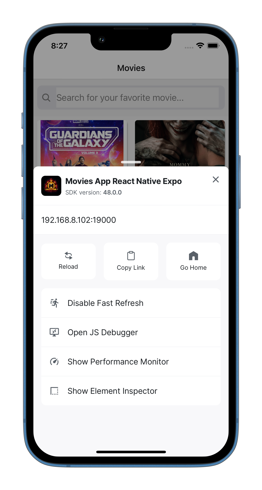
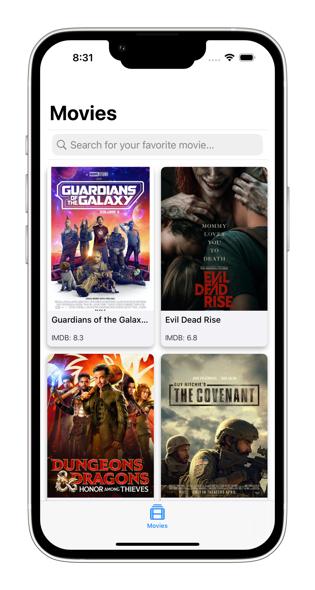

# Consolidated Movies App - Swift UIKit & React Native

This repository contains two distinct applications developed for iOS with the same functionality, one using Swift and UIKit, and the other using React Native with Expo CLI. Both applications are designed to integrate with the IMDb API, enabling users to search for movies and view detailed information about them.

The applications were created as coding exercises to demonstrate a broad understanding of various concepts in iOS development and React Native, such as API integration, UI design, user interaction handling, and state management.

# Contents

### Movies App - React Native - Expo
### Movies App - UIKit

## Movies App - React Native - Expo

Movies App - React Native - Expo is a React Native application built with Expo CLI, written in JavaScript. The application integrates with the IMDb API, allowing users to search for movies and view their details. This application was designed to fulfill a coding exercise that tests understanding and application of various mobile development concepts, such as API integration, UI design and user interaction handling.

## Features

Search Bar: The application provides a search bar where users can input keywords to search for movies.
- Search Bar

Fetching Movies: Upon a search query, the application fetches a list of matching movies from the IMDb API.
- Home

Detailed Movie Information: Tapping on a collection view cell opens a detailed view that displays more information about the selected movie, including the plot, release date, and cast members.
- Details

Error Handling: The application implements proper error handling mechanisms and displays appropriate error messages if the API request fails or no movies are found for the given search query.
- Error Handling

 

## Architecture

The application follows a modular structure based on the component philosophy of React. This structure promotes reusability and separation of concerns. Each component has its own functionality and rendering logic, encapsulated within the component itself.

 

## Components
Key components and their roles in the application include:

- MovieListScreen: This is a screen component that displays the list of movies. It is also responsible for managing the loading state while fetching movies.
- MovieDetailScreen: This screen component presents detailed information about a selected movie.
- MovieItem: This is a component used within the MovieListScreen to display each movie's title, poster image, and rating in the list.
- SearchBar: This reusable component provides a search bar for users to input their movie search keywords. It can be used in various parts of the application where a search functionality is needed.
- useMovies: This is a custom React Hook that encapsulates the logic for fetching movies from the IMDb API. It returns the list of movies, the loading state, and an error state, providing a clean interface to use within the screen components.

## Requirements

Node.js 12.0+
Expo CLI 3.0+

## How to Run

- Clone the repository to your local machine.
- Navigate to the project directory in your terminal.
- Install the dependencies by running npm install or yarn install.
- Start the Expo server by running npm start or yarn start.
- Open the app in either an iOS simulator, Android emulator, or your own mobile device using the Expo Go app.

# Movies App - UIKit

Movies App - UIKit is an iOS application written in Swift that integrates with the IMDb API, allowing users to search for movies and view their details. This application was designed to fulfill a coding exercise that tests understanding and application of various iOS development concepts, such as API integration, UI design and user interaction handling.

## Features

Search Bar: The application provides a search bar where users can input keywords to search for movies.
- Search Bar

Fetching Movies: Upon a search query, the application fetches a list of matching movies from the IMDb API.
- Home - Light

- Home - Dark

 

Detailed Movie Information: Tapping on a collection view cell opens a detailed view that displays more information about the selected movie, including the plot, release date, and cast members.
- Details - Light

- Details - Dark

 

Error Handling: The application implements proper error handling mechanisms and displays appropriate error messages if the API request fails or no movies are found for the given search query.
- Error Handling

 

## Architecture

The application follows the Model-View-ViewModel (MVVM) architectural pattern. The ViewModel classes handle the business logic, network requests and data manipulation, while the View classes are responsible for displaying the data on the screen.

## Accessibility

The application provides image accessibility by adding accessibility labels to images. This ensures that the content is accessible to all users, including those with visual impairments who may be using VoiceOver.

## Components

Here are some key classes and their roles in the application:

- MAMovieListView: Handles showing the list of movies and loading state.
- MAMovieDetailView: Handles showing the detailed information of a selected movie.
- MAMovieCollectionViewCell: Displays the movie's title, poster image, and rating in the collection view.
- RMHeaderSearchCollectionReusableView: Provides a search bar for users to input their movie search keywords.
- MAService & MARequest: Responsible for making network requests and handling the responses.

## Requirements

iOS 15.0+
Xcode 12.0+
Swift 5.0+

## How to Run

- Clone the repository to your local machine.
- Open the .xcodeproj file in Xcode.
- Select the appropriate target (your connected iOS device or a simulator) in the drop-down menu to the right of the "Run" and "Stop" buttons on the top left of the Xcode interface.
- Click "Run" and wait for the app to build and run.

# Note

This application was designed as part of a coding exercise and serves as a demonstration of iOS/React Native development skills. The code is provided as-is and the developer assumes no responsibility for any misuse.
